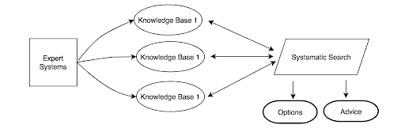

## MLOps - Deploy Machine Learning models using REST API

ML Model using IDENTITY MANAGEMENT and find a customer 'Risk decision'  or Fraud tolerance level while completing a online transaction.

### Summary

MLOps will guide the process to deploy Machine learning models using various techniques. We will be developing REST API's based on a model and deploy both on local and also on cloud servers. 

> ###### *Model used here is Identity Management model to predict a customer 'Risk decision score' and based on the prediction the system will either complete a transaction successfully or redirect to a different channel based on prediction score*

##### Limitations of this paper or method

1. Data used in this model creation is sample of a real-time set of data - and cannot be used in a non-test environment
2. Post-prediction of the model or process is not intended in this paper
3. Guideline here are to create a Enterprise AI using a model and MLOps deployment
4. This template will not be a complete reference for MLOps pipeline with cloud or a end to end using cloud architecture
5. Model uses precondition from building a knowledgebase system from both internal and external databases and systems

This template contains code for creating model(sample), saving and creating an API model for use with Enterprise AI service model.  The complete pipeline will demonstrate on how to automate an end-to-end ML/AI Enterprise AI workflow.

### Architecture and Features

Architecture and features covered in this paper will useful to build your ML pipeline once you model is created. you can use sample model code and scripts for the Identity management model.

1. Creating a Model

2. Saving a Model

3. Exporting the model to another environment

4. Create REST API 

5. Use the REST API as a internal or direct codebase program

6. Create a Machine Learning REST API on Clod Server - AZURE

7. Create a Machine Learning REST API on Clod Server - GCP (Google Cloud)

8. Create a Machine Learning REST API on Clod Server - AWS 

9. Create a Serverless Machine Learning REST API using Cloud Functions (GCP/AWS Lambda's)

   

### Solution Architecture

* Solution for ML model deployment techniques
* Deploying Machine learning models on cloud instances
* Serverless REST API's for Machine Learning Models

### Pre-requisite

* Python programming with knowledge of how to build ML and Deep Learning models .
* REST API knowledge / JSON formats
* DevOps or any deployment method 

## Getting Started

To get started and deploy the model and solution, you will need Python setup and coding Machine Learning models. You will find the code to build any advanced Scikit-learn models. 

#### Repository Details

You will find the details of the code and scripts in the repository here

#### References
* [General Knowledgebase Systems](https://en.wikipedia.org/wiki/Knowledge-based_systems)
* [Knowledbase Transformations](https://www.sciencedirect.com/science/article/pii/S0022000097914549)

## Contribution
This project or the paper welcomes contributions and suggestions. This paper is aindividual research, development and contribution which can be adopted based on your process and requirements. please see limitation of the paper and note the pre requirements before adoption or contribution to this paper.
